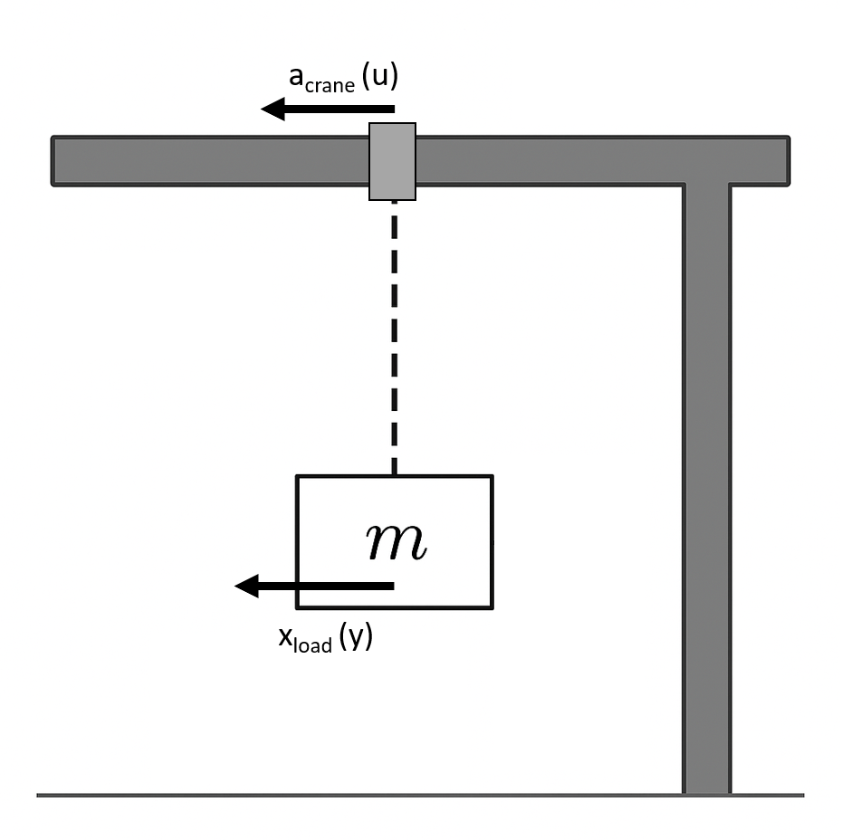

# MPC / RL Crane Control Project
A MATLAB repository for MPC and RBF Network to control the Crane Movement.

## System Overview



The overhead crane system consists of a trolley (carriage) moving along a horizontal rail,
with a load suspended by a rigid cable. The control input is the trolley acceleration,
and the objective is to move the load to desired positions while minimizing swing.

## Required toolboxes

- Symbolic Math Toolbox
- Control System Toolbox
- Model Predictive Control Toolbox

## Structure

```
nmpc-overhead-crane/
├── startup.m                     
├── main.m                       
│
├── src/                           
│   ├── config/                    
│   ├── models/                   
│   │   ├── state_definition.m
│   │   ├── mes_definition.m
│   │   ├── jacobianSys.m
│   │   └── discreteF.m
│   ├── control/                   
│   ├── estimation/               
│   │   └── predictRBF_craneTime.m
│   └── visualization/            
│       ├── animateCrane.m
│       ├── demo_animation.m
│       └── Crane_animation.md
│
├── tasks/                      
│   ├── task1_approximate_nonlinearity.m
│   ├── task2_nmpc.m
│   └── task3_observer_ekf.m
│
├── docs/                        
│   └── figures/
│       ├── crane.png
│       └── .gitkeep
│
├── data/                         
│   ├── simulations/             
│   ├── measurements/            
│   └── calibration/             
│
├── provided/                    
│   ├── MPC_Project.mlx
│   ├── MPC_Project.pdf
│   └── functions/
│       └── *.p files
│
└── .gitignore                  
```

## Tasks

1. **Approximate the non-linearity** — average repeated impulse-response
   measurements, derive accelerations from velocities, fit a Gaussian RBF
   network, build and validate the slip function.
2. **Crane with NMPC** — analyze controllability/observability/stability,
   define the non-linear model/measurement/Jacobian, set up `nlmpc()` with
   constraints, simulate a setpoint change and check real-time capability.
3. **Implement an observer** — add a continuous-discrete EKF, compare against
   the "real" crane via `responseCran`, and re-check real-time capability.

## Notes

- Files under `provided/` are placeholders for course-supplied functions;
  replace them with the originals.
- Fallback non-linearity if Task 1 is incomplete:
  `g(u) = (20/pi)*atan((pi/20)*u)`, `dg/du = ((pi^2*u^2)/400 + 1)^(-1)`.
```
